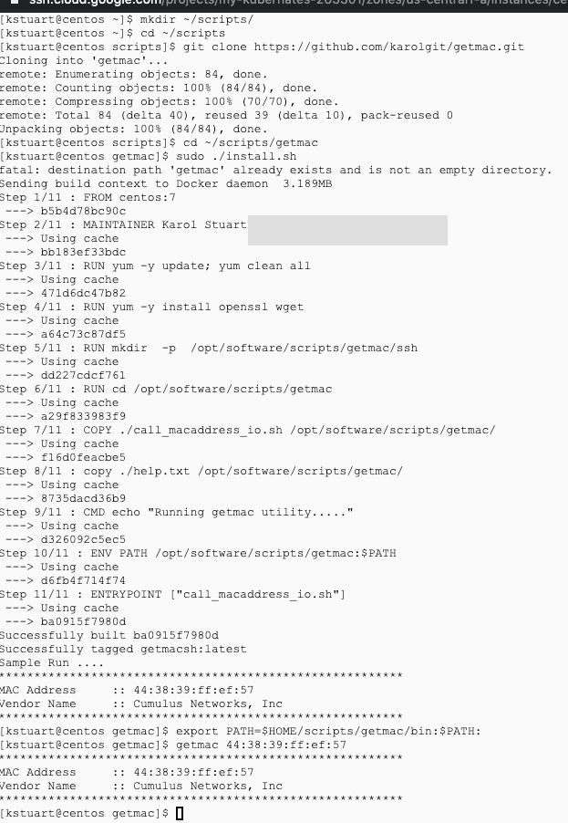
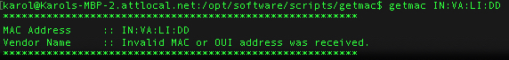
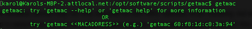
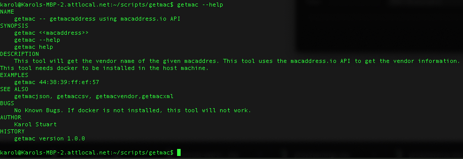

getmacaddress is a command line tool that gets the vendorname of the given macadress.

Usage
-----

``` sh
$ getmac <<MACADDRESS>>
```

Installation
------------

The `getmacaddress` executable has docker to be installed as a dependency

1. Install git  <BR>
   ``` Refer https://git-scm.com/book/en/v2/Getting-Started-Installing-Git.```<BR>
2. Install docker, start Docker and add your user to Docker group. Reconnect session after adding your user to docker group<BR>
   ``` Refer https://docs.docker.com/get-docker/```   <BR>
   ``` sudo service docker start ``` <BR>
   ``` usermod -G docker <YOUR USERID> ```<BR>
3. Make a directory to place the scripts and cd to this directory<BR>
   ``` mkdir ~/scripts/ ```   <BR>
4. cd to the newly created directory<BR>
   ``` cd ~/scripts  ```   <BR>
5. Clone this repository<BR>
   ``` git clone https://github.com/karolgit/getmac.git ```<BR>
6. cd to the cloned directory <BR>
   ``` cd ~/scripts/getmac  ```<BR>
7. Build this docker tool <BR>
   ```sudo ./install.sh ``` <BR>
8. Set the tool path (in .bashrc) <BR>
   ``` export PATH=$HOME/scripts/getmac/bin:$PATH: ``` <BR>
9. Run getmac MACADDRESS<BR>
   ``` (e.g.) getmac 44:38:39:ff:ef:57 ```<BR>



Security 
--------

The API Key generated from macaddress.io is encrypted and stored in cloud. In this example symmetric encryption is used. Encrypted apikey is stored in cloud. The Key to decrypt will be passed from local machine to docker container. We can also store password in secretmananger or vault and read from there. 

Sample Run 
----------


Invalid Input
-------------


NoInput
-------



Help Image
----------


This repository and its issue tracker is **not for reporting problems with
GitHub.com** web interface. If you have a problem with GitHub itself, please
[contact Support](https://github.com/contact).
